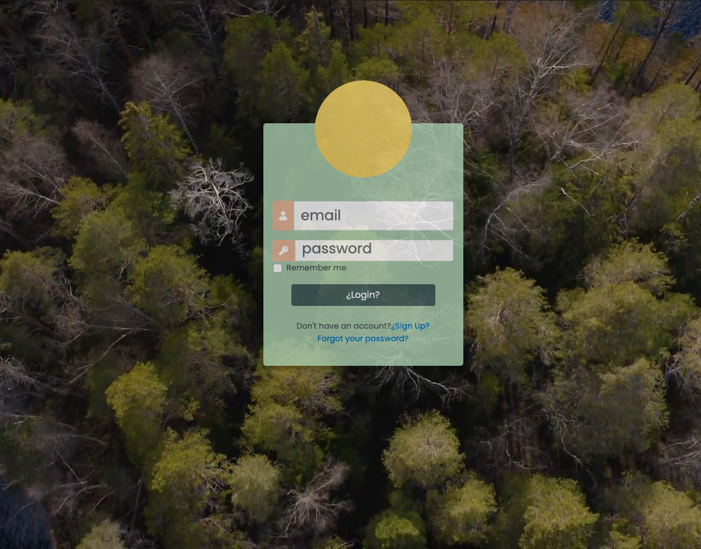
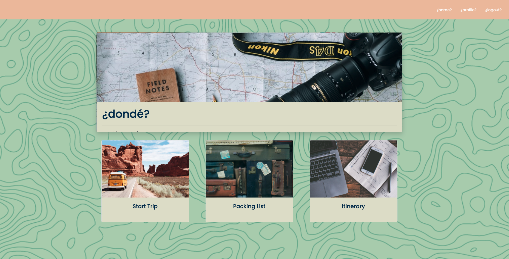

## dondé (dohn-deh)
 

## _Description_

This application was designed for the everyday person. Ask yourself this question; Have I ever needed a vacation so badly, but did not know where to start...yeah of course you have, we ALL have. Welcome to Dondé, (where) we take the hard work of planning Trips out of your hands! Our site helps optimize your travel itinerary to let you make the most out of your trip!

## _Technologies_

## _Usage_

The application can be viewed from here:
> https://shielded-woodland-30004.herokuapp.com/

You can find the application Repository here:
> https://github.com/jmasone15/travel-planner-project

## _Contributing //  Collaborators_

* [Curt Spiegelhalter](https://github.com/CSpiegelhalter)
* [Deleon Xavier Francis](https://github.com/deleonfrancis)
* [Jordan Masone](https://github.com/jmasone15)
* [J. Laro](https://github.com/JRLaro) 

  

## _Credits // License_

> MIT License
> Copyright (©) 2021, four-amigos

Permission is hereby granted, free of charge, to any person obtaining a copy of this software and associated documentation files (the "Software"), to deal in the Software without restriction, including without limitation the rights to use, copy, modify, merge, publish, distribute, sublicense, and/or sell copies of the Software, and to permit persons to whom the Software is furnished to do so, subject to the following conditions:

The above copyright notice and this permission notice shall be included in all copies or substantial portions of the Software.

THE SOFTWARE IS PROVIDED "AS IS", WITHOUT WARRANTY OF ANY KIND, EXPRESS OR IMPLIED, INCLUDING BUT NOT LIMITED TO THE WARRANTIES OF MERCHANTABILITY, FITNESS FOR A PARTICULAR PURPOSE AND NONINFRINGEMENT. IN NO EVENT SHALL THE AUTHORS OR COPYRIGHT HOLDERS BE LIABLE FOR ANY CLAIM, DAMAGES OR OTHER LIABILITY, WHETHER IN AN ACTION OF CONTRACT, TORT OR OTHERWISE, ARISING FROM, OUT OF OR IN CONNECTION WITH THE SOFTWARE OR THE USE OR OTHER DEALINGS IN THE SOFTWARE.